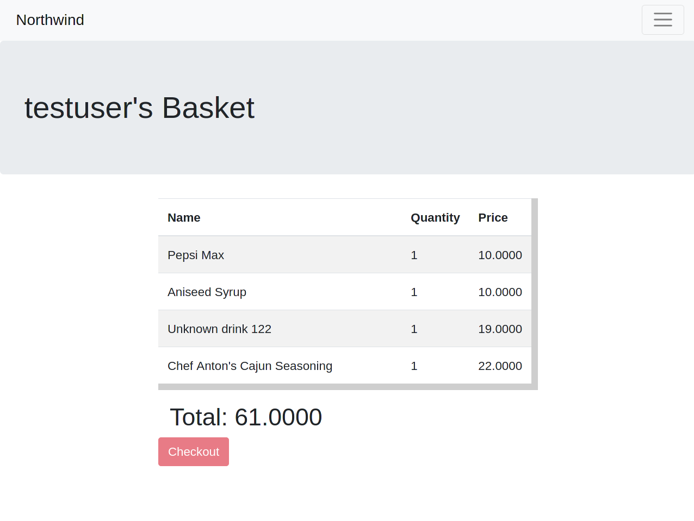

Curly Bassoon is a full stack Java Web app linked to the northwind database. This API runs on a Web Server allowing remote connections. This API allows you to 'Add', 'remove', 'update' elements within the database.

## Features

- Role-based product management
- View the data from the northwind database
- Add products to an order and store them in a basket

## Technologies used

- Hibernate ORM
- Spring boot
- Bootstrap
- Thymeleaf
- Tomcat

# Starting the project
We started out by making a trello board with all the user stories.

## Screenshots
### Log in page

### Homepage

### Products page

### Customers page

### Orders page

### Employee page

### Basket page

## Authors

- [@vlad](https://github.com/vladlogyin)
- [@bart](https://github.com/Baaartosz)
- [@kira-coke](https://github.com/kira-coke)
- [@dk](https://www.github.com/DogukhanK)
- [@billie](https://www.github.com/octokatherine)
- [@toby](https://github.com/tobygascoinge)